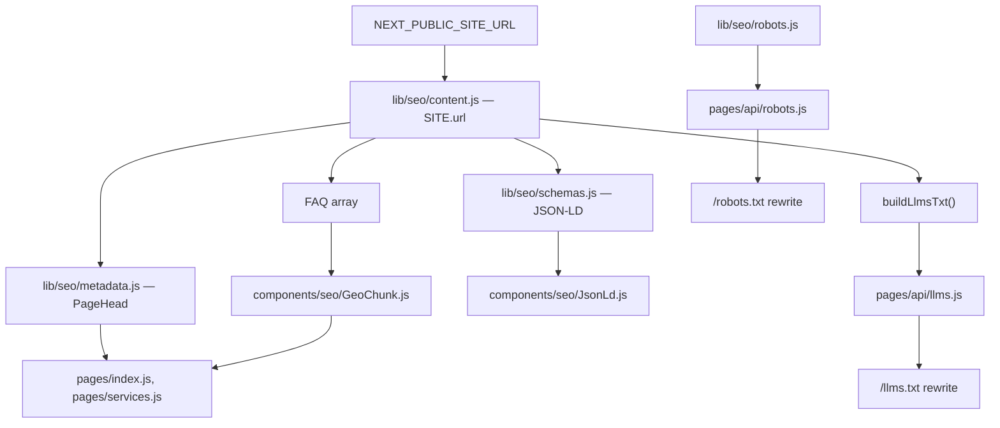

# Nextale Website — SEO & GEO Optimization Report

**Codebase:** `nextale-website`  
**Stack:** Next.js 14 (Pages Router), React 18  
**Report date:** June 26, 2026  
**Scope:** Traditional SEO, structured data, and Generative Engine Optimization (GEO)

---

## Executive Summary

SEO and GEO are implemented as a **small, centralized module** under `lib/seo/` and `components/seo/`, wired into only **two pages** (`/` and `/services`). The approach is deliberate:

| Layer | What it does | Coverage |
|-------|--------------|----------|
| **Traditional SEO** | `<title>`, meta description, canonical, Open Graph basics | Home + Services only |
| **Structured data** | Schema.org JSON-LD (`Organization` + `Service` graph) | Home + Services only |
| **GEO** | Hidden FAQ chunks (`GeoChunk`), `llms.txt`, `Llms-txt` in robots | Home + Services + global endpoints |

There is **no sitemap**, **no Twitter/X cards**, **no `og:image`**, and **no per-page metadata** on `/work`, `/process`, or `/contact`. There is also **no geographic/local SEO** — no location schema, NAP data, or regional targeting.

The canonical site URL is driven by `NEXT_PUBLIC_SITE_URL` and flows through metadata, JSON-LD, `robots.txt`, and `llms.txt`.

---

## Architecture Overview

```
lib/seo/
├── content.js      # Single source of truth: SITE, SERVICES, FAQ, buildLlmsTxt()
├── metadata.js     # PageHead component + HOME_META / SERVICES_META
├── robots.js       # buildRobotsTxt()
└── schemas.js      # buildAgencySchemas() → JSON-LD @graph

components/seo/
├── GeoChunk.js     # Q&A semantic HTML for GEO (visible or sr-only)
└── JsonLd.js       # Renders <script type="application/ld+json">

pages/api/
├── llms.js         # Serves llms.txt content
└── robots.js       # Serves robots.txt content

next.config.js      # Rewrites /llms.txt → /api/llms, /robots.txt → /api/robots

public/
└── googleb0e4778b5e01087b.html   # Google Search Console verification
```

**Data flow:**



---

## Configuration

### Environment variable

From `.env.example`:

```env
# Canonical base URL for SEO metadata, JSON-LD, llms.txt, and robots.txt
NEXT_PUBLIC_SITE_URL=https://nextale-demo.vercel.app
```

Used in `lib/seo/content.js`:

```js
const SITE_URL = (
  process.env.NEXT_PUBLIC_SITE_URL ?? "https://nextale-demo.vercel.app"
).replace(/\/$/, "");

export const SITE = {
  name: "Nextale",
  tagline: "From Paper to Pixel",
  url: SITE_URL,
  description:
    "Nextale is a creative and technology agency helping SMEs build brand identity, social-first content, and scalable digital products — from logos and campaigns to websites, apps, and automation.",
  contactPath: "/contact",
  disciplines: ["Creative", "Technology"],
};
```

Trailing slashes are stripped so canonical URLs stay consistent.

### Next.js rewrites

```js
async rewrites() {
  return [
    { source: "/llms.txt", destination: "/api/llms" },
    { source: "/robots.txt", destination: "/api/robots" },
  ];
},
```

`robots.txt` and `llms.txt` are **dynamically generated** API routes, not static files in `public/`.

---

## Traditional SEO

### `PageHead` component

Central metadata renderer in `lib/seo/metadata.js`:

```js
export function PageHead({ title, description, path }) {
  const canonicalUrl = `${SITE.url}${path}`;

  return (
    <Head>
      <title>{title}</title>
      <meta name="description" content={description} />
      <link rel="canonical" href={canonicalUrl} />
      <meta property="og:title" content={title} />
      <meta property="og:description" content={description} />
      <meta property="og:type" content="website" />
      <meta property="og:url" content={canonicalUrl} />
    </Head>
  );
}
```

**What is included:**

- `<title>`
- `meta name="description"`
- `link rel="canonical"`
- Open Graph: `og:title`, `og:description`, `og:type`, `og:url`

**What is missing:**

- `og:image` / `twitter:card` / `twitter:image`
- `robots` meta (noindex/nofollow per page)
- `hreflang` (single-language site; low priority)
- JSON-LD `WebSite` with `SearchAction`

### Page-level metadata constants

| Page | Constant | Title | Path |
|------|----------|-------|------|
| Home | `HOME_META` | `Nextale — Creative & Technology Agency` | `/` |
| Services | `SERVICES_META` | `Services — Nextale` | `/services` |

Home description comes from `SITE.description`. Services has a dedicated description string.

### Global document setup

**`pages/_document.js`** — HTML language:

```jsx
<Html lang="en">
```

**`pages/_app.js`** — viewport only (site-wide):

```jsx
<Head>
  <meta name="viewport" content="width=device-width, initial-scale=1" />
</Head>
```

Nav/footer live in `_app.js` with semantic `<header>`, `<nav>`, `<footer>` and `aria-label` attributes — good for crawlability and accessibility, though not SEO-specific modules.

### Page coverage matrix

| Route | `PageHead` | JSON-LD | `GeoChunk` | Visible `<h1>` |
|-------|------------|---------|------------|----------------|
| `/` | ✅ | ✅ | ✅ (hidden) | ✅ (`sr-only`) |
| `/services` | ✅ | ✅ | ✅ (hidden) | ✅ (visible) |
| `/work` | ❌ | ❌ | ❌ | ✅ (visible) |
| `/process` | ❌ | ❌ | ❌ | ✅ (visible) |
| `/contact` | ❌ | ❌ | ❌ | ✅ (visible) |
| `/testing` | ❌ | ❌ | ❌ | ✅ (dev/demo) |

Secondary pages inherit only the default Next.js `<title>` (route name) and no meta description unless the browser/framework provides a fallback.

### Google Search Console verification

Static file at `public/googleb0e4778b5e01087b.html`:

```
google-site-verification: googleb0e4778b5e01087b.html
```

Served at `https://<domain>/googleb0e4778b5e01087b.html` for domain ownership verification.

### `robots.txt`

Built by `lib/seo/robots.js`:

```js
export function buildRobotsTxt() {
  return [
    "User-agent: *",
    "Allow: /",
    "",
    `Llms-txt: ${SITE.url}/llms.txt`,
  ].join("\n");
}
```

Served via `pages/api/robots.js` with:

- `Content-Type: text/plain; charset=utf-8`
- `Cache-Control: s-maxage=3600, stale-while-revalidate`

**Gaps:**

- No `Sitemap:` directive
- No crawl rules for `/testing` or `/api/*`
- `Llms-txt` is a newer convention for LLM crawlers (GEO), not classic search-engine SEO

---

## Structured Data (JSON-LD)

### `JsonLd` component

```jsx
export default function JsonLd({ data }) {
  const payload = Array.isArray(data)
    ? { "@context": "https://schema.org", "@graph": data }
    : data;

  return (
    <script
      type="application/ld+json"
      dangerouslySetInnerHTML={{ __html: JSON.stringify(payload) }}
    />
  );
}
```

Accepts either a full schema object or an array (wrapped in `@graph`).

### Agency schema graph

`buildAgencySchemas()` in `lib/seo/schemas.js` emits:

1. **`Organization`** (`@id: {SITE.url}/#organization`)
   - `name`, `url`, `logo`, `slogan`, `description`
   - `knowsAbout`: 8 service areas
   - `sameAs`: **empty array** (no social profile URLs)

2. **`Service`** — Creative Services (`@id: .../#creative-services`)
   - `hasOfferCatalog` with 4 `Offer` items from `SERVICES.creative`

3. **`Service`** — Technology Services (`@id: .../#technology-services`)
   - `hasOfferCatalog` with 4 `Offer` items from `SERVICES.technology`

Provider references use `{ "@id": ORGANIZATION_ID }` for entity linking.

**Usage:** Injected on home and services:

```jsx
<PageHead {...HOME_META} />
<JsonLd data={buildAgencySchemas()} />
```

**Gaps:**

- No `FAQPage` schema (FAQ exists in content but not in JSON-LD)
- No `WebPage` / `BreadcrumbList` per route
- No `LocalBusiness` or `PostalAddress` (not a local SEO site)
- Logo URL `${SITE.url}/assets/nextale-logo.png` may **not resolve** — logo lives in `assets/nextale-logo.png` and is webpack-bundled via `_app.js`, not exposed at `/assets/nextale-logo.png` in `public/`

---

## GEO (Generative Engine Optimization)

In this codebase, **GEO = optimizing for AI/LLM crawlers and answer engines**, not geographic targeting. The name `GeoChunk` reflects that pattern.

### 1. `GeoChunk` — semantic Q&A blocks

```jsx
export default function GeoChunk({ items, hidden = false }) {
  const Tag = hidden ? "aside" : "section";

  return (
    <Tag
      className={hidden ? "sr-only" : undefined}
      aria-label="About Nextale"
    >
      {items.map(({ question, answer }) => (
        <section key={question}>
          <h2>{question}</h2>
          <p>{answer}</p>
        </section>
      ))}
    </Tag>
  );
}
```

**Strategy:**

- Renders FAQ pairs as real HTML (`<h2>` + `<p>`) for crawlers and LLMs
- `hidden={true}` applies `.sr-only` — visually hidden, still in DOM for parsers
- `aria-label="About Nextale"` for accessibility context

**Placement (complementary FAQ split):**

| Page | GeoChunk items | Source |
|------|----------------|--------|
| Home | `FAQ[0]`, `FAQ[3]` | “What does Nextale do?”, “What services does Nextale offer?” |
| Services | `FAQ[1]`, `FAQ[2]` | Creative services, Technology services |

Services also has a **visible** interactive FAQ (`SERVICES_FAQ`) separate from the centralized `FAQ` in `lib/seo/content.js` — UI copy vs. GEO/canonical knowledge base.

### 2. `llms.txt` — machine-readable site summary

`buildLlmsTxt()` in `lib/seo/content.js` generates markdown-style plain text:

- Site name, tagline, about paragraph
- Creative + Technology disciplines with bullet service lists
- All 5 FAQ entries from `FAQ`
- Links: website, services, work, contact
- Entity block: name, type, tagline

Served at `/llms.txt` via rewrite → `pages/api/llms.js` (same caching headers as robots).

**Purpose:** Follows the [llms.txt](https://llmstxt.org/) convention so LLM crawlers get a curated, citation-friendly summary without scraping the full React app.

### 3. `Llms-txt` in robots.txt

Points crawlers to `${SITE.url}/llms.txt` — ties classic `robots.txt` to GEO.

### 4. Single source of truth

`lib/seo/content.js` centralizes:

- `SITE` — brand entity
- `SERVICES` — feeds JSON-LD catalogs and llms.txt
- `FAQ` — feeds llms.txt and GeoChunk

This reduces drift between human-visible copy, structured data, and LLM-facing content — though the services page UI FAQ is still partially duplicated.

---

## Content & Semantic HTML (SEO-adjacent)

### Home (`pages/index.js`)

- **Hidden H1:** `<h1 className="sr-only">Nextale — Creative and Technology Agency</h1>` — primary keyword H1 without conflicting with visual hero
- **Story section:** Narrative beats with internal links to `/work` and `/contact`
- **Capabilities grid:** Service names and descriptions in visible HTML
- **ARIA labels** on major sections (`aria-label="Who we help"`, etc.)

### Services (`pages/services.js`)

- Visible H1: “Everything your brand needs, under one roof.”
- Long-form service content, process steps, visible accordion FAQ
- Hidden GeoChunk for LLM-oriented service definitions

### Other pages

- `/work`, `/process`, `/contact`: Semantic structure (`<main>`, `<h1>`, `<section>`) but **no SEO module integration**
- `/testing`: Internal demo page; no SEO treatment

### Accessibility utility supporting GEO

```css
.sr-only {
  position: absolute;
  width: 1px;
  height: 1px;
  padding: 0;
  margin: -1px;
  overflow: hidden;
  clip: rect(0, 0, 0, 0);
  white-space: nowrap;
  border: 0;
}
```

Used for hidden H1 and hidden GeoChunk — content remains parseable by bots that execute JS and read the DOM.

---

## Dependencies & Tooling

No dedicated SEO libraries (`next-seo`, `@vercel/og`, etc.). Implementation is hand-rolled with `next/head`. No build-time sitemap generation.

---

## Gaps & Recommendations

### High impact

| Gap | Risk | Suggested direction |
|-----|------|---------------------|
| No metadata on `/work`, `/process`, `/contact` | Weak snippets, duplicate/generic titles | Add `WORK_META`, etc., and `PageHead` on each page |
| No `sitemap.xml` | Slower/incomplete discovery | API route or `next-sitemap` at build time |
| Logo URL in JSON-LD may 404 | Rich result / knowledge panel issues | Copy logo to `public/` or use absolute CDN URL |
| No `og:image` | Poor social previews | Default OG image in `PageHead` or per-page overrides |
| `sameAs: []` in Organization | Weaker entity graph | Add Facebook, Instagram, LinkedIn URLs when live |

### GEO-specific

| Gap | Risk | Suggested direction |
|-----|------|---------------------|
| No `FAQPage` JSON-LD | Missed rich results + LLM entity linking | Mirror `FAQ` in schema on home/services |
| `SERVICES_FAQ` vs `FAQ` duplication | Inconsistent AI citations | Align or cross-reference canonical FAQ answers |
| GeoChunk only on 2 pages | Thin entity signals elsewhere | Optional hidden chunks on work/contact with page-specific Q&A |

### Not applicable (by design)

- **Geographic/local SEO:** No address, `LocalBusiness`, Google Business Profile integration, or geo meta — appropriate for a non-location-bound agency brand unless you add a physical office strategy.

### Low priority

- Twitter/X card tags
- `WebSite` + `SearchAction` schema
- `noindex` on `/testing`
- `robots.txt` `Disallow: /api/`

---

## File Reference Index

| File | Role |
|------|------|
| `lib/seo/content.js` | Site config, services, FAQ, `buildLlmsTxt()` |
| `lib/seo/metadata.js` | `PageHead`, page meta constants |
| `lib/seo/robots.js` | `buildRobotsTxt()` |
| `lib/seo/schemas.js` | `buildAgencySchemas()` JSON-LD |
| `components/seo/JsonLd.js` | JSON-LD script tag |
| `components/seo/GeoChunk.js` | GEO Q&A HTML blocks |
| `pages/api/llms.js` | `llms.txt` handler |
| `pages/api/robots.js` | `robots.txt` handler |
| `next.config.js` | URL rewrites |
| `pages/index.js` | Home SEO + GEO wiring |
| `pages/services.js` | Services SEO + GEO wiring |
| `public/googleb0e4778b5e01087b.html` | Google verification |
| `.env.example` | `NEXT_PUBLIC_SITE_URL` documentation |

---

## Summary

This codebase treats SEO and GEO as a **focused, two-page concern** with **shared content primitives** and **LLM-specific surfaces** (`llms.txt`, `Llms-txt`, hidden `GeoChunk`). Traditional SEO covers title, description, canonical, and basic Open Graph on home and services only. Structured data describes the agency and its service catalog as a linked Schema.org graph. GEO optimizes for AI discovery through machine-readable FAQs in the DOM and a dedicated `llms.txt` endpoint.

The main weaknesses are **incomplete page coverage**, **missing sitemap and social images**, a **potentially broken JSON-LD logo URL**, and **no FAQ schema** — not a lack of geographic optimization, which was never in scope.
